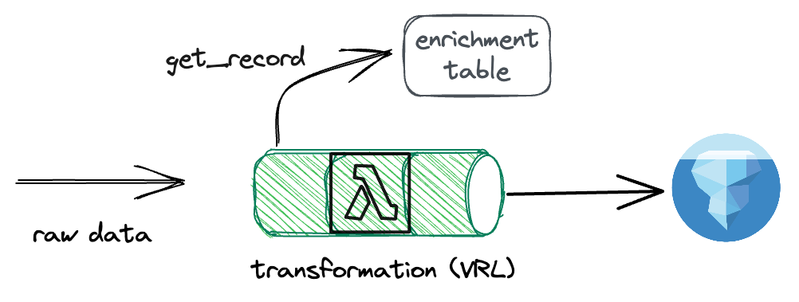

<head>
  <meta name="twitter:creator" content="@AhmedSamrose" />
</head>

Matano now supports realtime streaming enrichment for log sources, allowing you to enrich your data in realtime as it is ingested into Matano. This powerful new feature allows you to add contextual information directly into your data without the need for a join or lookup later on.

<!-- truncate -->

## Enrichment overview

Enrichment in Matano refers to adding contextual information to your data. This can be anything from adding a user's name to adding geolocation information based on an IP address. Enrichment allows you to add context to your data, making it easier to understand and analyze. Matano already supports enrichment, in the form of [enrichment tables](https://www.matano.dev/docs/enrichment/overview).

<div style={{ width: "75%", margin: "0 auto", textAlign: "center" }}>


_Previously available enrichment mechanisms_

</div>

Previously, these enrichment tables were only ingested into Apache Iceberg tables, allowing you to perform SQL joins, as well as being made available inside Python detections using a lookup helper method. While this were powerful features, they come with some limitations, as they require a separate lookup, which can cause performance issues and ergonomic challenges, especially in SQL as it requires writing a join even for a simple lookup.

## How realtime enrichment works

Realtime enrichment works by allowing you to add enrichment data into your data during the _transformation_ step. As a recap, Matano contains an embedded transformation engine that allows you to write transformation scripts using the Vector Remap Language (VRL). This transformation is run in realtime as data is ingested into Matano.

<div style={{ width: "75%", margin: "0 auto", textAlign: "center" }}>



_Realtime streaming enrichment_

</div>

The new realtime enrichment feature works by adding a new function available inside your VRL transformation scripts, called `get_enrichment_table_record`. This function allows you to lookup a value by a key from an enrichment table.

The realtime enrichment feature is designed to be highly performant. The enrichment data is stored in a highly optimized custom format, and is cached in memory for fast lookups.

Because this lookup happens during the transformation step, the enrichment data is added directly into your data, allowing you to access it directly without having to perform any lookups or joins.

## How to use realtime enrichment

To use realtime enrichment, we use the `get_enrichment_table_record` function inside our VRL transformation scripts. This function takes two arguments, the first is the name of the enrichment table, and the second is the value to lookup. The function returns a record, which can be used to access the fields inside the enrichment table.

For example, let's say we have an enrichment table called `users`, which contains the following fields (the enrichment table has a single lookup key on `user_id`):

- `user_id`
- `user_name`
- `user_email`

We can use the `get_enrichment_table_record` function to lookup a user's name, given their user ID, like so:

```go
user_info = get_enrichment_table_record("users", user_id)
```

## An example of using realtime enrichment

Let's look at a concrete example. Say we have a log source that contains the following fields:

- `user_id`
- `ip_address`
- `timestamp`

We want to enrich this data with the user's name, as well as the user's email address. We have an enrichment table called `users`, with a single lookup key on `user_id`, which contains the following fields:

- `user_id`
- `user_name`
- `user_email`

We can use the `get_enrichment_table_record` function to lookup the user's name and email address, and add two new fields to our data, `user.name` and `user.email`, containing the user's name and email address, like so:

```go
user_info = get_enrichment_table_record("users", .user_id)
.user.name = user_info.user_name
.user.email = user_info.user_email
```

## Get started

You can start using the realtime enrichment feature today. Read the complete reference documentation [here](https://www.matano.dev/docs/enrichment/realtime-data-enrichment). We'll also be further expanding our enrichment capabilities in the future, including dedicated support for geolocation and IP address enrichment. Stay tuned for more updates!
